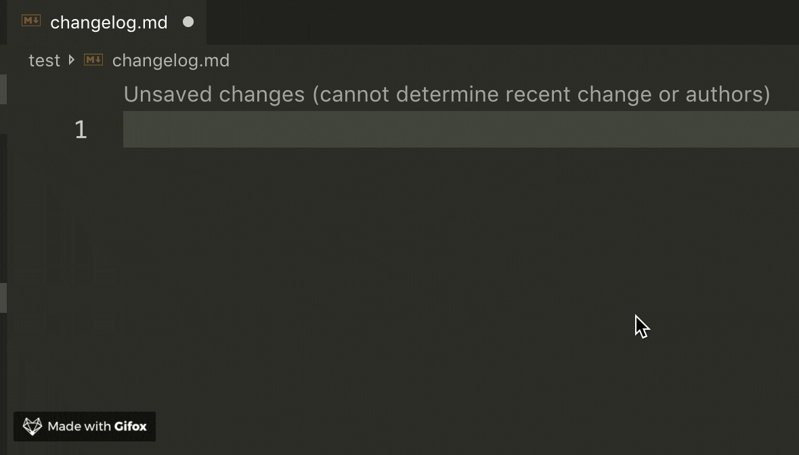

# changelog-snippets

changelog snippets for vscode



## snippets

| Prefix                  | Function                                  |
| ----------------------- | ----------------------------------------- |
| `changelog-init-full`   | init changelog for full format            |
| `changelog-init-simple` | init changelog for simple format          |
| `changelog-new-version` | add changelog for new version             |
| `changelog-added`       | add added-item for a version changelog    |
| `changelog-changed`     | add changed-item for a version changelog  |
| `changelog-fixed`       | add fixed-item for a version changelog    |
| `changelog-removed`     | add removed-item for a version changelog  |
| `changelog-security`    | add security-item for a version changelog |

## tips

- make sure open the quickSuggestions of markdown

```json {3}
  "[markdown]": {
    "editor.quickSuggestions": {
      "other": true, // this must be true
      "comments": false,
      "strings": false
    }
  }
```

## related

- [keep a changelog](https://keepachangelog.com)
- [semver](https://semver.org/)